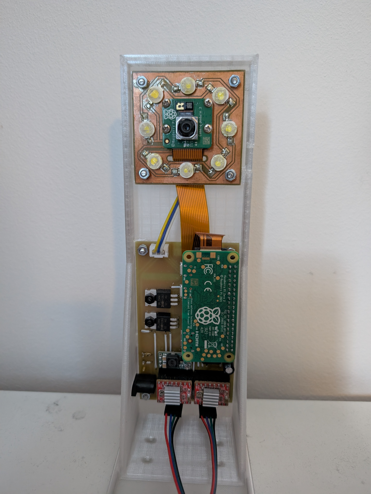

# [JOpenScan](https://github.com/petrvlasak/jopenscan?tab=readme-ov-file#jopenscan) - Pi Shield and Ringlight PCBs

These PCBs are compatible with the original [OpenScan](https://openscan.eu/) DIY 3D Scanner [firmware](https://openscan-org.github.io/OpenScan-Doc/firmware/setup/). They contain some improvements:

- Pi Shield
  - Proper current limiting resistors for MOSFETs in Ringlight control
  - Software shutdown of stepper motors (available only in [JOpenScan firmware](https://github.com/petrvlasak/jopenscan))
- Ringlight
  - Removed unnecessary current limiting resistors

